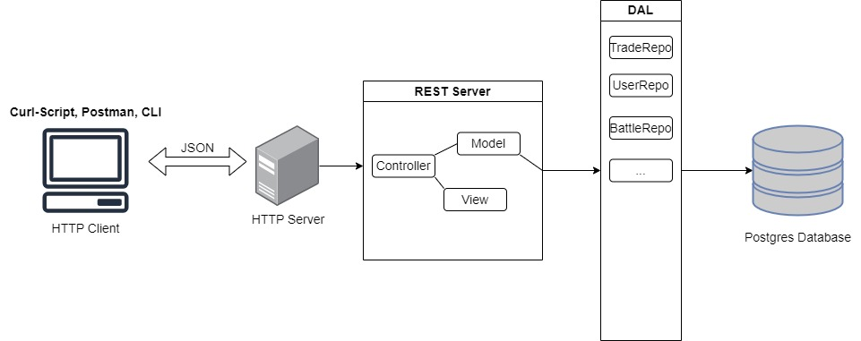

# MTCG SWEN Projekt
# Design

# Lessons Learned
Einige wichtige Aspekte, die ich im Laufe dieses Projektes gelernt habe, sind:
- Code immer in kleinen Paketen zu testen 
- Payloads von Request immer ausgeben, um zu überprüfen, ob Daten im richtigen Format sind, bzw. richtig dekodiert und formatiert wurden
- Mit Debuggen können viele Fehler schnell behoben werden

Beim BattleService hatte ich Schwierigkeiten damit, dass die User im Curl-Skript, die Lobby fast gleichzeitig betreten. Dadurch kam es oft dazu, dass zwei separate Lobbys erstellt wurden und das Spiel somit nicht gestartet hat. Dies wurde durch einen synchronized-Block gelöst. Dabei wird ein gewisser Codeabschnitt von einem Thread gesperrt, solange bis er von diesem wieder freigegeben wird. Dadurch konnte der Bereich, in dem die Lobby erstellt wurde, geschützt werden. 

# Unit Tests
Ich habe meine Unit Tests ausschließlich an das „.yaml“ Dokument angelehnt und sie dementsprechend konzipiert. Es gibt jeweils einen Test für jeden HTTP-Response-Code. 

# Tracked Time 
| Datum       | Zeit[h] | Kommentar                              |
|-------------|---------|----------------------------------------|
| 20.10.22    | 3       | Docker Installation & PostgreSQL Image |
| 21.10.22    | 4       | Datenbank entwurf erstellen            |
| 25.10.22    | 1       | Github Repository erstellt             |
| 01-30.10.22 | 15      | Implementierung Http-Server            |
| 27.10.22    | 2       | Datenbankverbindung                    |
| 28.10.22    | 5       | Implementierung User-Service           |
| 29.10.22    | 4       | Impl. Session Service                  |
| 30.10.22    | 2       | Tests für Services                     |
| 16.11.22    | 5       | Unit of Work                           |
| 17.11.22    | 2       | DB Singleton & Properties              |
| 20.11.22    | 6       | Package Service                        |
| 21.11.22    | 4       | Transactions Controller                |
| 26.11.22    | 4       | Card Service                           |
| 29.11.22    | 6       | Deck Service                           |
| 30.11.22    | 8       | Stats & Trading Service                |
| 01.12.22    | 4       | Trading Service fertigstellen          |
| 02-03.12.22 | 9       | Battle Service                         |
| 08-09.12.22 | 10      | Bug Fixing                             |
| Gesamt      | 94      |                                        |
